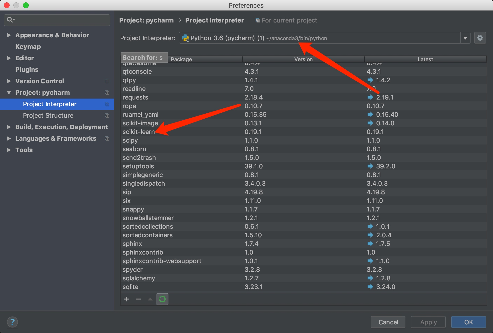

# Hello world in maching learinng

## 1.什么是机器学习呢?
_https://baike.baidu.com/item/%E6%9C%BA%E5%99%A8%E5%AD%A6%E4%B9%A0/217599?fr=aladdin_
简单来说,机器学习可以看作是人工智能的一个分支。早在1996年Deep Blue与Garry Kasparov的国际象棋比赛机器就战胜了人,但Deep Blue只是单一的会一种技能。而如今所提出的机器学习确是一个涉及广泛,并且在多个领域,涉及了概率论、统计学加上更复杂的算法学科,专门研究计算机模拟人类的学习行为,以获取新的知识或技能,重新组织已有的知识结构使之不断改善自身性能的过程。
总结来讲:就是通过模拟人类思维方法,通过大量的训练不段提高自身,以更接近人类思考的过程。
## 2.机器学习有哪些好用的框架呢?
Apple ML: Swift
Google: TensorFlow
Facebook: Torch
Python: Scikit-learn
我们即将要使用的就是Scikit-learn，基于Python,它构建于NumPy及SciPy库之上,每个库都负责较低层级的数据科学任务。然而，当NumPy处理数值计算时，SciPy库包含更具体的数值流程，例如优化和插值。随后，scikit-learn被用于机器学习，在Python生态系统中，这三种工具与其它工具之间的关系反映了数据科学领域中不同层级：层级越高，能解决的问题就更加具体。
## 3.安装Scikit-learn机器学习环境
Scikit-learn的官网是 http://scikit-learn.org/stable/

#### 1.到 http://scikit-learn.org/stable/install.html 上面找到

点击Anaconda进入到Anaconda，这是一个隔离环境,不需要把scikit-learn安装到系统环境,学习的时候避免污染了系统的python环境
2.到 https://www.anaconda.com/download/#macos 这个上面下载安装

安装命令行环境
3.安装成功后可以到/Users/xxxx/目录下找到anaconda3目录
4.进入bin 使用./conda install scikit-learn安装我们需要的package
5.怎么确认scikit-learn是否安装成功呢？
使用Pycharm配置 anaconda3/bin/python

也可以使用命令行查看./conda list

还可以使用./conda info scikit-learn 查年具体的信息
conda使用文档在此: https://docs.anaconda.com/anaconda/packages/pkg-docs
到此我们的隔离于系统的python之scikit-learn就安装完成了

## 4.开始Python scikit-learn 的Hello world
在Pycharm中新建一个xxx.py文件
import sklearn 
编译没有问题就可以准备写第一个Hello world程序了

先来看一个图表:

这个表格简单的描述了一下兔子与老鼠的特征:长耳朵短尾巴的是兔子,短耳朵长尾巴的是老鼠
表格中的前两列是用于机器识别的特征,最后一列是类型.在机器学习里面特征是Feature,类型是Label
表中的每一行表示一个Example(样本数据),整个表格就是 trainging data,我们现在就是要用这个training data 来训练机器模型

最后得到的结果是:

符合我们对兔子与老鼠的特征定义

我们不需要关心具体的算法,只需要把数据特征给Classifier进行不断的学习,就会得到一个更接近识别真相的结果了。

到此 我们基于scikit-learn的Hello world就已经完成了

