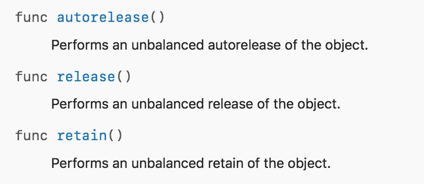

# 浅谈 Unmanaged
从这个单词的字面意义可以简单的来理解一下:非托管对象,意思就是对象本身不完全由ARC管理,在某种程度上需要由我们自己进行内存管理。Swift引入这个类是用来解决Core Foundation的内存管理问题。因为我们没办法像使用Objective-C中的__bridge 与 __bridge_retained来桥接管理Core Foundation对象的内存。
### 要搞清楚Unmanged做了什么,首先我们来看一下Objective-C中对CF对象的一些操作:

这一段代码测试了在Objective-C中托管与非托管对象的引用计数器,结果为:

可以看出__bridge只转换了对象,但未对对象的引用计数器进行操作__bridge_retained不仅转换了对象还对对象的引用计数器增加了1

在Swift中我们不能直接使用这样的操作,Swift的工程师优雅的设计了Unmanged类来实现与CF对象的桥接工作,下面我们来看一个Swift桥接对象的例子:

从上面这段代码可以看出,实际实现的功能与Objective-C中的__bridge与__bridge_unretained是一样的效果。
至此我们就搞清楚了Unmanged的作用与意图。
### Core Foundation中的API怎么返回的呢？
遵循Objective-C对ARC的设计原则,Create Copy的方法Core Foundation会返回一个非托管的Unmanged<T>对象,将内存管理权限交给开发者,诸如Get等开头的方法会直接返回一个安全的Swift对象,所以我们自己开发的C语言接口也需要遵守同样的规则。
### Unmanged的方法说明

以上三个方法与MRC时代的内存管理是一致的效果

takeRetainedValue与takeUnretainedValue是从非托管对象中拿回真正的Swift对象,区别就是是否需要在拿加对象后对Swift对象的引用计数进行操作,与passRetained与passUnretained是对应的。

#### toOpaque()在文档中的定义是:
Unsafely converts an unmanaged class reference to a pointer.
将Unmanged<T>对象转换成一个不安全的原始指针
我对原始指针做了一个测试,将其转换成Unmanged<CFString>中的CFString类型的指针,得到的是一个_NSContiguousString的对象

_NSContiguousString可以在https://github.com/apple/swift/blob/master/stdlib/public/core/StringBridge.swift中找到对象的定义,是一个转换过程中产生的内部对象

这个方法与toOpaque是一对应的,将一个C指针转换成一个非托管的对象

至此相信你已经对Unmanged有了一个全面的了解了。

