# 一个更真实的机器学习例子
首先我们到 https://en.wikipedia.org/wiki/Iris_flower_data_set#Data_set 这个网站去找到Iris的一个真实的数据

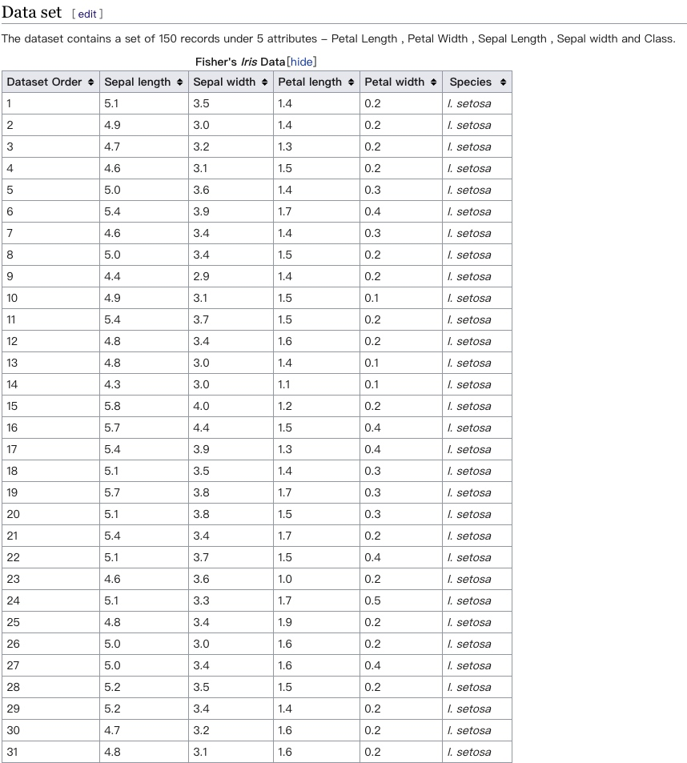
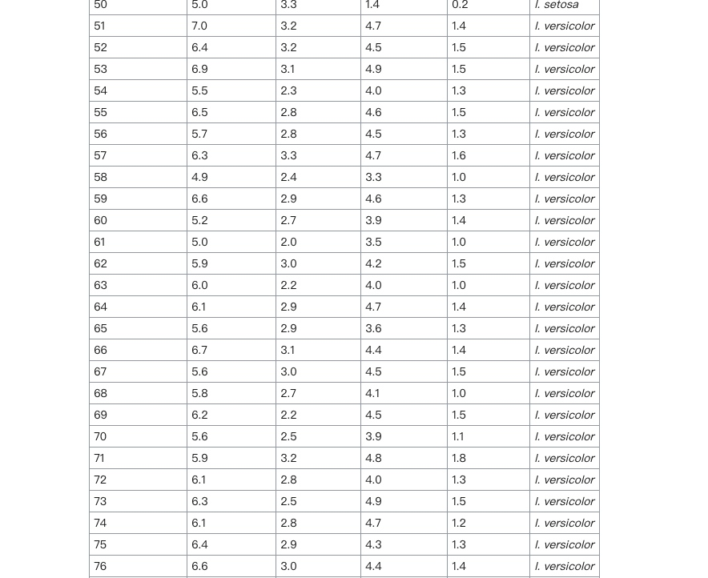
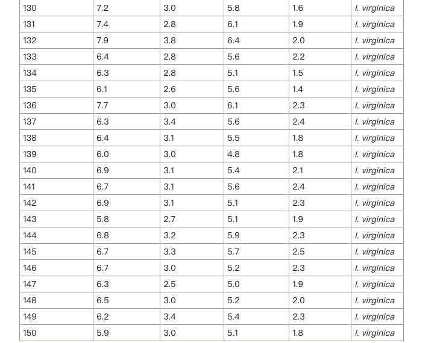
从这个数据可以看出,每一种花都采集了50个样本,每一个样本都 有4个Feature

从scikit中导入iris的数据,因为它已经集成了iris的数据,我们可以直接使用

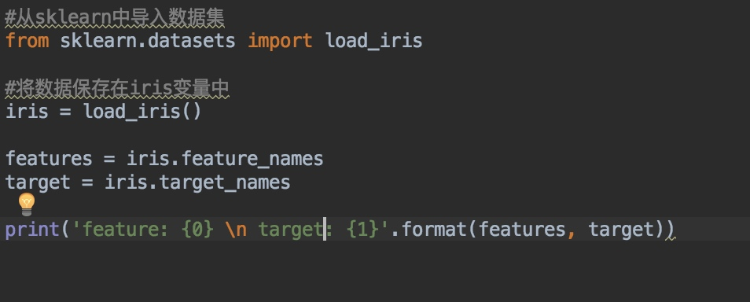
导入数据，并打印出feature 与 target
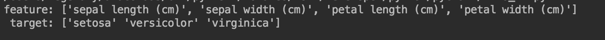

## 现在我们需要将iris的数据,导入并进行训练.

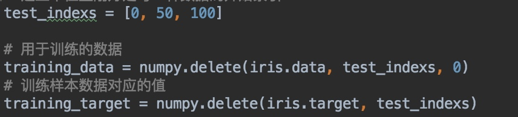
首先,生成用于训练的样本数据,这里我们从原始样本数据中删除0，50，100三个位置的样本数据,剩下的数据就是用于训练的样本数据

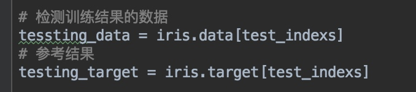

然后我们再从原始样本数据中抽取0,50,100三个位置的数据用于训练检测.这是非常必要的,我们训练的结果需要测试才知道训练的效果怎么样的。
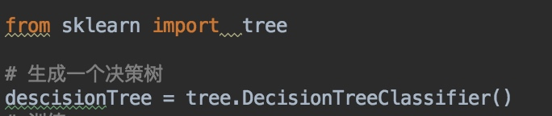
然后从sklearn中导入tree,并生成一个用于训练的解决树 Classifier

训练模型
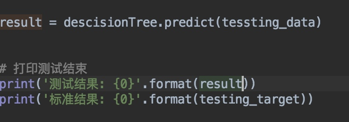
用测试样本数据预测结果,打印后对比标准结果

从结果可知,机器学习后的效果还是令人满意的

## 最后我们来看一下机器学习中DecisionTreeClassifier究竟是如何完成学习并判断的

http://scikit-learn.org/stable/modules/tree.html
到这个网址去复制下面的代码来生成一个可视化的决策树PDF文件 

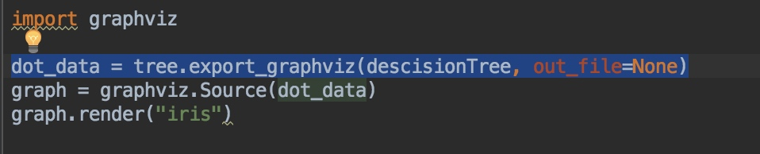

打开PDF文件可以看出决策树最终是如何对过Feature来判断数据的
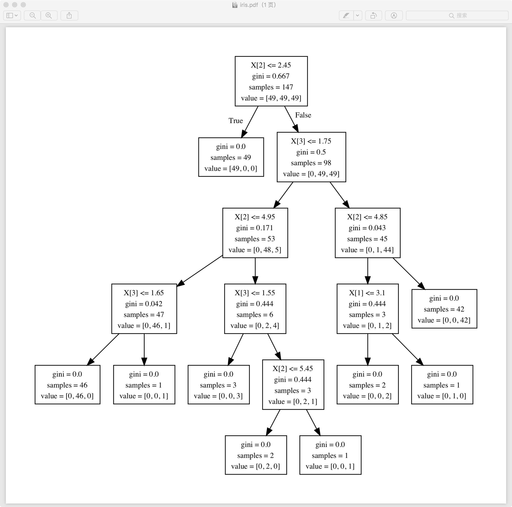

至此,我们已经完成了对一个完整的数据的训练与测试,并从可视化角度看到了决策树生成判断的过程。

