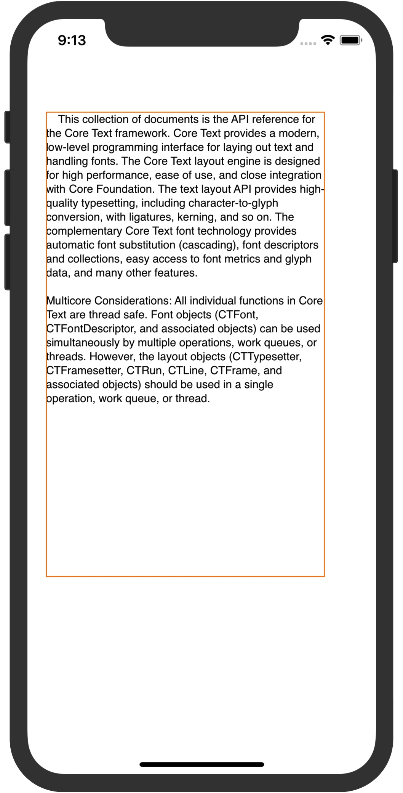

# ** 浅谈 CoreText In Swift **
简介: 高质量的字符排版引擎。

CoreText 排版渲染原理


整个渲染界面叫CTFrame，它就像一个画布一样,每个CTFrame有一行或者 多行,每一行是叫CTLine。一行中有一个或者多个CTRun，每一个CTRun都有独立的用于渲染各种效果的设置。


 
有人会问,那为什么需要CTLine呢。这个CTLine可以计算出整个行的高度,因为字符的渲染不是完全对齐的,有些字符是上出头,有些是下出头,还有些CTRun可能是占位图(自定义了大小),CTLine的高度保证了一行中所有的CTRun都能够完整的渲染出来。

CoreText只负责渲染出文本来,点击事件还需要配合UIGestureRecognizer或者UIResponder对事件的影响处理来完成。那点击的实现原理是什么呢?
前面我们提到了CTRun,他不仅包含了渲染需要的各种属性配置,还包含了渲染的区域大小,这样我们就可以通过点击事件获取到的Location(x,y)来判断到底点击到了哪一个CTRun或者点击到了哪一行CTLine。

上代码:
实现一个最简单的CoreText渲染

渲染效果如下:

可以看出来,画布与我们所预期的效果是上下翻转了的,这是因为CoreText的渲染就是以左下角为原点从左向右,从下到上进行渲染的。既然这样,我们就将画布进行上下翻转



接下来给NSMutableAttributedString添加一些简单的效果

对应如下图:


那怎么添加图片到文字中去呢？
就要用到CTRun的代理CTRunDelegateCallbacks


占位的CTRunDelegate有了,接下来就是需要把图片画上去或者把UIView添加到占位的位置了。


这里要漏掉一点:占位图可以预先用一个特殊的字符去占位,然后在添加CTRunDelegate的时候获取到这个位置

到此:图片也就添加上去了


再添加个行间距

效果如下:


要动态计算Core Text的高度只需要计算出每一行CTLine的高度与行间距的高度,就能动态计算出整个高度了

注意:
Core Foundation有部分接口返回的是Unmanged<T>的非托管对象,这类对你需要注意的是内存的管理,
而返回托管对象的如:CTFramesetterCreateWithAttributedString CTFramesetterCreateFrame
不再需要像Objective-C那样去CFRelease了


```
 override func draw(_ rect: CGRect) {
        
        let string = """
            This collection of documents is the API reference for the Core Text framework. Core Text provides#a modern, low-level programming interface for laying out text and handling fonts. The Core Text layout engine is designed for high performance, ease of use, and close integration with Core Foundation. The text layout API provides high-quality typesetting, including character-to-glyph conversion, with ligatures, kerning, and so on. The complementary Core Text font technology provides automatic font substitution (cascading), font descriptors and collections, easy access to font metrics and glyph data, and many other features.

        Multicore Considerations: All individual functions in Core Text are thread safe. Font objects (CTFont, CTFontDescriptor, and associated objects) can be used simultaneously by multiple operations, work queues, or threads. However, the layout objects (CTTypesetter, CTFramesetter, CTRun, CTLine, CTFrame, and associated objects) should be used in a single operation, work queue, or thread.
        """
        let attrString = NSMutableAttributedString(string: string)
        
        attrString.addAttributes([NSAttributedStringKey.font : UIFont.systemFont(ofSize: 30)], range: NSRange(location: 10, length: 20))
        attrString.addAttributes([NSAttributedStringKey.backgroundColor : UIColor.purple], range: NSRange(location: 15, length: 30))
        
        //设置行间距
        let paragraphStyle = NSMutableParagraphStyle()
        paragraphStyle.lineSpacing = 20
        attrString.addAttributes([NSAttributedStringKey.paragraphStyle : paragraphStyle], range: NSRange(location: 0, length: string.count))
        
        var ctRunDelegate = CTRunDelegateCallbacks(version: kCTRunDelegateVersion1, dealloc: { _ in
            print("CTRunDelegateCallbacks Dealloc")
        }, getAscent: { _ in 100
        }, getDescent: { _ in 0}, getWidth: { _ in 110})
        //创建一个CTRunDelegate对象,第一个值描述了占位的具体大小信息
        //第二个值是传递到回调函数里面refCon的值
        if let ctRunDelegateRef = CTRunDelegateCreate(&ctRunDelegate, nil) {
            attrString.addAttributes([NSAttributedStringKey.init(kCTRunDelegateAttributeName as String) : ctRunDelegateRef], range: NSRange(location: string.index(of: "#")!.encodedOffset, length: 1))
        }
        
        
        let frameSetter = CTFramesetterCreateWithAttributedString(attrString)
        //限定你要从创建CTFrameSetter中的NSArributedString中渲染的字符范围,如果这个值被设定为(location:0,length:0),就会渲染整个字符
        let stringRange = CFRange()
        var transform = CGAffineTransform.identity
        //限定渲染的画布范围,矩阵变化用默认值
        let path = CGPath(rect: self.bounds, transform: &transform)
        let ctFrame = CTFramesetterCreateFrame(frameSetter, stringRange, path, nil)
        guard let context = UIGraphicsGetCurrentContext() else { return }
        
        print(context.textMatrix,context)
        //设置最初变化之前的矩阵为默认的矩阵
        context.textMatrix = CGAffineTransform.identity
        //向下移动画布的高度的位移
        context.translateBy(x: 0, y: self.frame.size.height)
        //将矩阵翻转
        context.scaleBy(x: 1.0, y: -1.0)
        //最后渲染出来的就是从左到右从上到下的
        CTFrameDraw(ctFrame, context)

        //获取版本的数组
        let lines = CTFrameGetLines(ctFrame)
        let lineOriginsPoint = UnsafeMutablePointer<CGPoint>.allocate(capacity: CFArrayGetCount(lines))
        //得到每一行的起始点
        CTFrameGetLineOrigins(ctFrame, CFRange(location: 0, length: 0), lineOriginsPoint)
        //将指向CGPoint数组的指针转换成一个Buffer指针,相当于Buffer指向了数组,并且可以遍历,Buffer实现了Collection Protocol
        let buffer = UnsafeBufferPointer<CGPoint>.init(start: lineOriginsPoint, count: CFArrayGetCount(lines))
        for i in 0..<CFArrayGetCount(lines) {
            if let ctLinePoint = CFArrayGetValueAtIndex(lines, i) {
                //这里要注意的是:从CFDictionary获取的Value是Unmanged非托管对象
                let ctLineUnmanged = Unmanaged<CTLine>.fromOpaque(ctLinePoint)
                //获取非托管对象中的值,这里使用的是unretained 不对对象的引用计数器增加
                let ctLine = ctLineUnmanged.takeUnretainedValue()
                let lineOrigin = buffer[i]
                var ascent: CGFloat = 0
                var descent: CGFloat = 0
                var leading: CGFloat = 0
                CTLineGetTypographicBounds(ctLine, &ascent, &descent, &leading)
                let runs = CTLineGetGlyphRuns(ctLine)
                let count = CFArrayGetCount(runs)
                for j in 0..<count{
                    if let ctRunPoint = CFArrayGetValueAtIndex(runs, j) {
                        let ctRunUnmanged = Unmanaged<CTRun>.fromOpaque(ctRunPoint)
                        let ctRun = ctRunUnmanged.takeUnretainedValue()
                        let attribute = CTRunGetAttributes(ctRun)
                        let key = Unmanaged.passRetained(kCTRunDelegateAttributeName).toOpaque()
                        var run_ascent: CGFloat = 0
                        var run_descent: CGFloat = 0
                        var run_leading: CGFloat = 0
                        let range = CTRunGetStringRange(ctRun)
                        CTRunGetTypographicBounds(ctRun, CFRange(location: 0, length: CTRunGetGlyphCount(ctRun)), &run_ascent, &run_descent, &run_leading)
                        let height = run_ascent + run_descent
                        //注意: CFDictionaryGetValue中的参数Key 是一个非托管对象Unmanged<CFString>的指针
                        if let _ = CFDictionaryGetValue(attribute, key) {
                            let image = UIImage(named: "presence_offline")!
                            if let p = CTRunGetAdvancesPtr(ctRun) {
                                let xOffset = CTLineGetOffsetForStringIndex(ctLine, range.location, nil)
                                //lineOrigin.y 是baseline的y坐标,如果要下对齐,还需要向下偏移descent
                                let rect = CGRect(x: lineOrigin.x + xOffset, y: lineOrigin.y - descent/*向下偏移*/ , width: p.pointee.width, height: height)
                                context.draw(image.cgImage!, in: rect)
                            }
                        }
                    }
                }
            }
        }
        
    }
```


