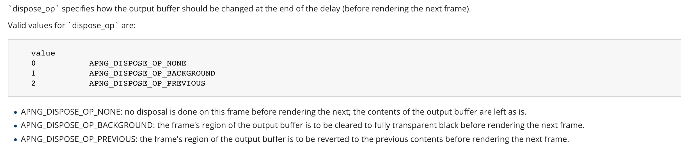

# **从零开始实现一个APNG Decoder(Swift, iOS)
**
本文基于Swift,开源项目地址:https://github.com/czqasngit/BerryPlant
参考:
https://en.wikipedia.org/wiki/Portable_Network_Graphics
https://en.wikipedia.org/wiki/APNG

**更好的方案是使用C实现解码部分.**

**要做好APNG的解码,首先得了解APNG的格式**

## 1.什么是APNG ？
不同的图片格式的文件有不同的压缩算法,不同的数据组织结构.
APNG也是一种文件格式,他是基于PNG扩展出来的一种类似GIF的动态图片格式.
不同于GIF的是他是存在Alpha通道的,解析后就是一帧一帧的PNG图片.
### 既然APNG是PNG的扩展,那我们首先得搞清楚PNG的文件结构.

图中所画就是PNG的数据结构
PNG signature: PNG图片的签名,32字节,值是固定的: '.PNG'(89 50 4E 47 0D 0A 1A 0A)
IHDR、Other Chunks、IDAT、Other Chunks、IEND都被统一成一种结构,称为Chunk
图中所示Chunk的结构
4个字节表示长度,4个字节表示Chunk的类型,length个字节表示chunk 的数据,CRC4个字节用于校验数据
IHDR: 图片的元数据
Other Chunks: 在这里我暂且这样称呼,这里表示有一个或者多个连续的Chunk


图中所示就是Other Chunks可能的类型值
IDAT:图片数据
IEND:结束Chunk
有了以上的完整的PNG数据就可以被标准的PNG Decoder解码,iOS中我使用
CGDataProvider
CGImageSourceCreateWithDataProvider
来解析并得到数据

### PNG的数据结构搞清楚了,我们就可以来撸一撸APNG的数据结构了

APNG的第一帧就是一个PNG,只是Other Chunks里面多了两种在PNG中没有的Chuck,分别是acTL与fcTL。在标准的PNG解码器中可以将APNG的第一帧解析出来并生成图片,acTL与fcTL也并不会影响到解码器,因为他们只是用于起控制作用的Chunk,并不会影响到IDAT里面的数据.
在维基百科上面看这幅图时可能会有些疑惑,因为他省略了一些细节的东西,这样会对解码APNG过程有一定的影响。
### 解码APNG的流程大致是这样的:
###### 1.拿到文件数据,分离签名与Chunk
###### 2.获取APNG的元数据与acTL(总动画控制)
###### 3.提取第一帧PNG
###### 4.以第一帧为参考,将后续fdAT解析出来替换第一帧IDAT的位置生成每一帧的图片
###### 5.用fcTL(帧动画控制)的属性渲染图片

下面用Swift在iOS系统为例实现一下解析与渲染:
1.分离签名与Chunk
2.提取元数据与acTL

```
func parseChunks() {
        var offset = 8
        var stop = false
        var firstHalfEnd = false
        while !stop {
            let chunkDataLength = UInt32.from(of: data, from: offset, to: offset + 4).bigToHost()
            let chunkLength = 4 + 4 + chunkDataLength + 4
            let chunkType = String.from(source: data, from: offset + 4, to: offset + 8)
            let chunk = BerryAPNGChunk(start: offset, end: offset + numericCast(chunkLength), length: chunkLength, type: chunkType)
            if chunk.type == "" {
                break
            }
            self.chunks.append(chunk)
            if chunk.type == "IEND" {
                stop = true
            }
            offset += numericCast(chunkLength)
            if !firstHalfEnd && chunk.type == "fcTL" {
                firstHalfEnd = true
            }
            if chunk.type != "fcTL" && chunk.type != "fdAT" && chunk.type != "IDAT", chunk.type != "acTL" {
                if !firstHalfEnd { common.appendFirstHalf(chunk) }
                else { common.appendSecondHalf(chunk) }
            }
            if chunk.type == "acTL" {
                self.actl = BerryAPNGACTL(with: data.subdata(in: (chunk.start + 8)..<chunk.end - 4))
            }
            if chunk.type == "IHDR" {
                self.ihdr = BerryAPNGIHDR(with: data.subdata(in: (chunk.start + 8)..<chunk.end - 4))
            }
        }
        for var i in 0..<chunks.count {
            if chunks[i].type == "fcTL" {
                frames.append(BerryAPNGFrame(idat: chunks[i + 1],
                                        fctlData: self.data.subdata(in: (chunks[i].start + 8)..<chunks[i].end)))
                i += 1
            }
        }
    }
```
以Chunk结构为基础,分离出所有的Chunk

```
if !firstHalfEnd && chunk.type == "fcTL" {
                firstHalfEnd = true
            }
            if chunk.type != "fcTL" && chunk.type != "fdAT" && chunk.type != "IDAT", chunk.type != "acTL" {
                if !firstHalfEnd { common.appendFirstHalf(chunk) }
                else { common.appendSecondHalf(chunk) }
            }
```
这一部分是以提取第一帧为模板,以方便后续拼接每一帧为一个完整的PNG结构


```
for var i in 0..<chunks.count {
            if chunks[i].type == "fcTL" {
                frames.append(BerryAPNGFrame(idat: chunks[i + 1],
                                        fctlData: self.data.subdata(in: (chunks[i].start + 8)..<chunks[i].end)))
                i += 1
            }
        }
```
从chunks中分离出图片帧的原始数据每一帧由一个fcTL与一个IDAT或者fdAT组成
要组成完整的PNG结构就要用到我们前面解析出来的PNG signature与other chunks还有IEND了

解码的第一步就是把每一帧组织成一个完整的PNG结构,然后使用iOS的Core Graphics框架来解码并生成UIImage

```
func getPNGData(with frame: BerryAPNGFrame, fileData data: Data) -> Data {
        var pngData = Data()
        pngData.append(signature.data)
        meger(with: frame, from: chunks1, from: data, to: &pngData)
        appendIDAT(with: frame, from: data, to: &pngData)
        meger(with: frame, from: chunks2, from: data, to: &pngData)
        return pngData
    }
```
这一部分就是将一帧原始的fcTL+IDAT/fdAT的数据结构其它chunk与签名组织成一个完整的PNG
渲染APNG拼接成的图片与渲染一个单独的PNG格式文件的图片还是有些区别的,渲染PNG只有一帧只会考虑帧内压缩,并不会考虑帧间压缩。而APNG为了达到更高的压缩率在帧与帧之前使用了帧间压缩,渲染每一帧的模式由fcTL控制。
1.创建一个完整的画布

```
let fullRect = CGRect(x: 0, y: 0, width: CGFloat(self.ihdr.width), height: CGFloat(self.ihdr.height))
```
这里需要注意的就是 APNG中fcTL的y_offset是至下而上的,而我们画图是从上到下的,所有画图的offsetY需要单独计算一下。
 
```
let offsetY = self.ihdr.height - frame.fctl.y_offset - frame.fctl.height
let drawRect = CGRect(x: CGFloat(frame.fctl.x_offset), y: CGFloat(offsetY), width: CGFloat(frame.fctl.width), height: CGFloat(frame.fctl.height))
```
 
fcTL中有两个非常重要的属性,用于控制下一帧画图的操作

```
var dispose_op: UInt8
var blend_op: UInt8
```

    


###### dispose_op 指定了当前帧渲染完成后应该对缓存区做什么操作
NONE:什么也不做，直接把新的图片数据渲染到画布指定的区域
BACKGROUND:渲染完当前帧将缓存区清空
PREVIOUS:在渲染下一帧前将缓存区中的图片恢复到成上一帧

blend_op 指定是否完全替换缓冲区中的内容,意思就是是否在渲染当前帧之前清空缓存

SOURCE: 表示要清空
OVER: 表示不清空

```
 public func decode(at index: Int) -> CGImage? {
        guard frames.count > index else { return nil }
        let frame = frames[index]
        let data = common.getPNGData(with: frame, fileData: self.data)
        guard let provider = CGDataProvider(data: data as CFData),
              let source = CGImageSourceCreateWithDataProvider(provider, nil),
              let originCGImage = CGImageSourceCreateImageAtIndex(source, 0, nil) else { return nil }
        var image: CGImage? = nil
        let offsetY = self.ihdr.height - frame.fctl.y_offset - frame.fctl.height
        let fullRect = CGRect(x: 0, y: 0, width: CGFloat(self.ihdr.width), height: CGFloat(self.ihdr.height))
        let drawRect = CGRect(x: CGFloat(frame.fctl.x_offset), y: CGFloat(offsetY), width: CGFloat(frame.fctl.width), height: CGFloat(frame.fctl.height))
        if frame.fctl.dispose_op == APNG_DISPOSE_OP.none.rawValue {
            if(frame.fctl.blend_op == APNG_BLEND_OP.source.rawValue) {
                context.clear(drawRect)
            }
            context.draw(originCGImage, in: drawRect)
            image = context.makeImage()
        } else if frame.fctl.dispose_op == APNG_DISPOSE_OP.background.rawValue {
            if(frame.fctl.blend_op == APNG_BLEND_OP.source.rawValue) {
                context.clear(drawRect)
            }
            context.draw(originCGImage, in: drawRect)
            image = context.makeImage()
            context.clear(drawRect)
        } else {
            let previousCGImage = context.makeImage()
            if(frame.fctl.blend_op == APNG_BLEND_OP.source.rawValue) {
                context.clear(drawRect)
            }
            context.draw(originCGImage, in: drawRect)
            image = context.makeImage()
            if let previousCGImage = previousCGImage {
                context.clear(fullRect)
                context.draw(previousCGImage, in: fullRect)
            }
        }
        return image
    }
```

至此,解码APNG的每一帧图片已经完成了,接下来就是怎么组织这些帧,应该怎么播放,每一帧播放多久,
每一帧都由fcTL chunk控制

```
@objc func render(){
        guard let link = self.link else { return }
        let linkDuration = link.duration
        self.currentDelay -= linkDuration
        if self.currentDelay <= 0 {
            self.showNextImage()
            let delay = imageProvider.frameDuration(at: self.currentIndex)
            self.currentDelay = (self.currentDelay + delay)
        }
    }
```
到此可以做一个小结了,文中只展示了重要的逻辑部分的代码,完整代码就从文首的Github上下载。
### 小结:
  APNG其实并不复杂,这里面涉及到了一些知识点
  1.图片格式的本质:本质就是组织管理图片数据,每一种图片格式都有它独特的数据压缩管理方式
  2.APNG图片的压缩方式,帧内与帧间,这与视频压缩类似
  3.图片渲染原理,本文以iOS平台为例


# 

